# Settlla — System Sequence Diagrams
## The Digital Rental Closing Engine (MVP Build)

- **Reference Spec**: [requirements.md](file:///c:/Users/User/OneDrive/Desktop/SETTLLA-STARTUP/requirements.md)
- **User Flow Reference**: [user-flow.md](file:///c:/Users/User/OneDrive/Desktop/SETTLLA-STARTUP/user-flow.md)
- **Date**: 2026-09-15

---

## 1. Main Flow: End-to-End Tenancy Closing & Escrow Settlement

This sequence diagram illustrates the end-to-end data movement between the **Tenant (Hajara)**, **Frontend Client (Web App)**, **Settlla Backend Server**, **Database**, **Payment Gateway (Paystack/Monnify)**, **Property Manager (HB&A Partners)**, and **Landlord** across all four phases of the closing engine:

```mermaid
sequenceDiagram
    autonumber
    actor Tenant as Tenant (Hajara)
    participant App as Settlla Web Client
    participant Server as Settlla Backend API
    participant DB as Postgres Database
    participant Gateway as Payment Gateway (Paystack/Monnify)
    actor Manager as Property Manager (HB&A)
    actor Landlord as Landlord (Offsite)

    %% PHASE 1: INSPECTION BOOKING
    rect rgb(22, 27, 34)
    note right of Tenant: Phase 1: Listing Discovery & Free Inspection Booking
    Tenant->>App: Browse listings in Barnawa
    App->>Server: GET /api/listings?neighborhood=Barnawa
    Server->>DB: Query verified listings (mandate_verified = true)
    DB-->>Server: Return listings + visiting windows
    Server-->>App: 200 OK (Listings with rent, caution, fees)
    App-->>Tenant: Render listing cards & all-in pricing

    Tenant->>App: Select 30-min slot (e.g. Sat 11:30 AM)
    Tenant->>App: Input Name, Phone, Email & Submit
    App->>Server: POST /api/inspections/book {listingId, slotTime, tenantInfo}
    Server->>DB: Check slot availability & insert inspection record
    DB-->>Server: Slot locked (inspection_id)
    Server-->>App: 201 Created (Booking confirmed, fee = 0)
    Server-)Tenant: SMS: Inspection confirmed with directions & manager contact
    Server-)Manager: SMS: New inspection booked for Barnawa Flat 2B
    App-->>Tenant: Display Confirmation & Calendar Pass
    end

    %% PHYSICAL WALKTHROUGH
    rect rgb(26, 32, 44)
    note over Tenant, Manager: Physical Inspection Walkthrough (Zero Fee Charged)
    Tenant->>Manager: Meet at Barnawa property for physical tour
    Manager-->>Tenant: Conduct walkthrough of fixtures, water & electricity
    end

    %% PHASE 2: LEASE GENERATION & E-SIGNATURE
    rect rgb(22, 27, 34)
    note right of Tenant: Phase 2: Identity Verification & Dynamic Lease Execution
    Tenant->>App: Click "Proceed to Rent" & Upload NIN + Posting Letter
    App->>Server: POST /api/tenancy/apply {listingId, idDocs, employmentProof}
    Server->>DB: Save tenant credentials & generate agreement draft
    Server->>Server: Auto-populate Kaduna statutory covenants & Mandate signatory clause
    Server-->>App: Return auto-generated Tenancy Agreement payload
    App-->>Tenant: Render lease document on screen

    Tenant->>App: Draw digital signature & tap "Sign Agreement"
    App->>Server: POST /api/tenancy/sign-tenant {tenancyId, signatureHash}
    Server->>DB: Update tenancy (tenant_signed = true, timestamp)
    Server-)Manager: SMS/Email alert: "Tenant signed lease. Counter-signature required"
    Server-->>App: 200 OK (Awaiting manager signature)

    Manager->>App: Log in, review verified tenant NIN & counter-sign
    App->>Server: POST /api/tenancy/sign-manager {tenancyId, managerSignature}
    Server->>DB: Update tenancy (manager_signed = true, status = "Awaiting Payment")
    Server->>Server: Compile final executed PDF contract
    Server-->>App: 200 OK (Contract finalized)
    Server-)Tenant: SMS: Lease executed. Ready for checkout
    end

    %% PHASE 3: CHECKOUT & 4-WAY SPLIT PAYMENT
    rect rgb(22, 27, 34)
    note right of Tenant: Phase 3: Checkout & Automated 4-Way Payment Split
    Tenant->>App: Review checkout summary & tap "Pay Securely via Escrow"
    App->>Server: POST /api/payments/initialize {tenancyId}
    Server->>Server: Calculate split: Legal (5%), Agency (10%), Caution (10%), Rent (75%)
    Server->>Gateway: POST /transaction/initialize {amount, email, subaccount_splits}
    Gateway-->>Server: Return payment reference & checkout URL
    Server-->>App: Return authorization URL / modal config
    App-->>Tenant: Render Paystack/Monnify payment gateway

    Tenant->>Gateway: Authorize full payment (₦650,000 via Card/Transfer)
    Gateway-->>Tenant: Payment Successful confirmation
    Gateway->>Server: Webhook: charge.success {reference, splits, status}
    Server->>Server: Verify cryptographic webhook signature
    Server->>DB: Update tenancy status to "Paid / In Escrow"
    Server->>Gateway: Disburse Legal Fee (5%) -> Legal Drafter Account
    Server->>Gateway: Disburse Agency Commission (10%) -> HB&A Partners Account
    Server->>Server: Route Caution Deposit (10%) -> Ringfenced Vault / PayRep
    Server->>Server: Hold Rent (75%) -> Key-in-Door Move-In Escrow
    Server-)Tenant: SMS: Payment receipt & Move-In Pass issued
    Server-)Landlord: SMS: "₦487,500 rent secured in escrow. Clears upon key handover"
    Server-)Manager: SMS: Payment confirmed. Proceed with key handover
    end

    %% PHASE 4: MOVE-IN & ESCROW CLEARANCE
    rect rgb(22, 27, 34)
    note right of Tenant: Phase 4: Key Handover & Escrow Payout Clearance
    Tenant->>Manager: Arrive at apartment on move-in day & receive keys
    Manager-->>Tenant: Hand over door keys
    Tenant->>Tenant: Test keys, verify running water & access
    Tenant->>App: Click "Confirm Key Handover" button
    App->>Server: POST /api/escrow/release {tenancyId}
    Server->>DB: Validate status == "In Escrow" & no disputes active
    Server->>Gateway: POST /transfer/disburse-rent {landlordAccountId, amount: ₦487,500}
    Gateway-->>Server: Transfer 200 OK (Disbursed)
    Server->>DB: Update tenancy status to "Active" (escrow_released = true)
    Server-)Landlord: Bank Credit Alert: "₦487,500 received from Settlla Escrow"
    Server-)Tenant: SMS: Tenancy active. Caution deposit remains ringfenced
    Server-->>App: 200 OK (Move-In Complete)
    App-->>Tenant: Display "Welcome to Your New Home" dashboard
    end
```



### Key Data Invariants Enforced in Main Flow:
1. **Mandate-Guarded Listings**: A property cannot appear in the listing query unless `mandate_verified = true` in the database.
2. **Fixed Window Slot Locking**: The backend rejects any inspection booking that falls outside the manager's recurring schedule or overlaps with an existing reserved slot.
3. **Atomic 4-Way Split**: The payment gateway routes agency and legal fees immediately while strictly isolating the caution deposit into a non-landlord reserve and parking the rent in escrow.
4. **Safety Timer Fallback**: If the tenant does not click "Confirm Key Handover" within 24 hours post-scheduled move-in time and no dispute is filed, a background cron task auto-triggers step 46 to disburse the landlord's rent.

---

## 2. Exception Path: Move-In Key Failure / Fraud Dispute ("Report a Problem")

This sequence diagram illustrates the emergency mitigation flow when a tenant arrives on move-in day and encounters fraud, inoperable keys, or unlivable misrepresentation:

```mermaid
sequenceDiagram
    autonumber
    actor Tenant as Tenant (Hajara)
    participant App as Settlla Web Client
    participant Server as Settlla Backend API
    participant DB as Postgres Database
    participant Gateway as Payment Gateway
    participant Ops as Settlla Concierge Team
    actor Manager as Property Manager (HB&A)

    note over Tenant, Manager: Move-In Day: Keys fail to unlock door / Apartment occupied by stranger
    Tenant->>Tenant: Tests keys; door remains locked / Landlord locked gate
    Tenant->>App: Opens Settlla Dashboard (before 24-hr timer expires)
    Tenant->>App: Clicks "Report a Problem"
    App-->>Tenant: Prompt: Select issue type & upload photo/video proof
    Tenant->>App: Select "Key Failure / Access Denied" + attach evidence
    Tenant->>App: Taps "Submit Emergency Dispute"

    App->>Server: POST /api/escrow/dispute {tenancyId, reason, evidenceUrls}
    
    %% EMERGENCY ESCROW FREEZE
    critical Immediate Escrow Freeze
        Server->>DB: Update tenancy status = "Disputed / Escrow Frozen"
        Server->>DB: Cancel 24-hour auto-release timer
        Server->>Gateway: POST /escrow/hold-freeze {transactionRef}
        Gateway-->>Server: Freeze Confirmed (Payout locked)
    end

    Server->>Ops: High-Priority Alert: "Dispute logged for Barnawa Flat 2B"
    Server-)Tenant: SMS: "Dispute received. Escrow frozen. 100% money protected."
    Server-)Manager: SMS: "Urgent: Tenant reported access failure. Funds held."
    Server-->>App: 200 OK (Dispute Active Screen)
    App-->>Tenant: Display "Escrow Frozen: Our Kaduna team is intervening"

    %% RAPID OPS INVESTIGATION
    rect rgb(22, 27, 34)
    note over Ops, Manager: 2-Hour Escalation Window
    Ops->>Manager: Call HB&A Partners to verify situation
    Manager-->>Ops: Confirms landlord changed locks without notice / Breach of Mandate
    Ops->>Server: POST /api/admin/resolve-dispute {tenancyId, verdict: "FAULT_LANDLORD", action: "FULL_REFUND"}
    end

    %% INDEMNITY REFUND
    rect rgb(22, 27, 34)
    note over Server, Gateway: 100% Scam Indemnity Guarantee Execution
    Server->>Gateway: POST /refunds/initiate {transactionRef, amount: 100%, destination: TenantBank}
    Gateway-->>Server: Refund 200 OK (Reversed)
    Server->>DB: Update tenancy status = "Terminated - Refunded"
    Server->>DB: Blacklist/Suspend listing mandate
    Server-)Tenant: SMS & Bank Alert: "₦650,000 100% refunded to your account"
    Server-)Manager: SMS: "Tenancy cancelled due to landlord breach"
    App-->>Tenant: Display "Refund Issued: 100% of your funds have been returned"
    end
```

### Key Exception Guarantees:
1. **Zero Cash Loss**: Escrow freeze executes synchronously on the database and payment gateway before any dispute investigation commences.
2. **Timer Preemption**: Filing "Report a Problem" immediately cancels the 24-hour automated release countdown.
3. **100% Indemnity Refund**: Settlla reverses the full sum (annual rent and caution deposit) directly back to the tenant's originating funding source.
